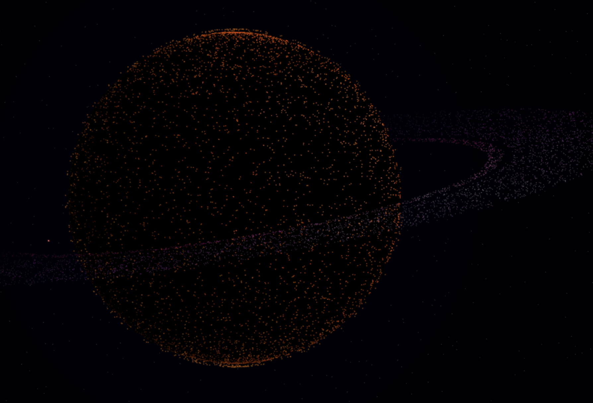
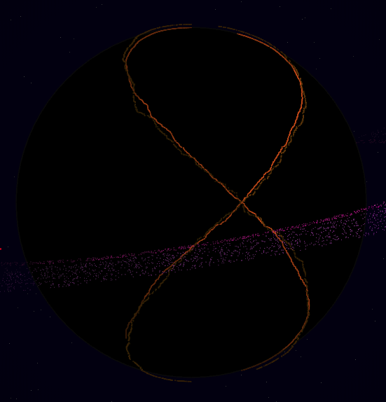

# Globe

A rotating globe made of thousands of particles, rendered on a 2D canvas using vanilla Javascript. I admit the final scene is a bit darker than what I wanted, so you may need to increase monitor brightness to be able to fully see it.

## Doing canvas optimization

Here's some annotations I did while I was developing it. The challenge here was to see how many particles could I render using HTML5 canvas in 2D rendering mode, doing all model and projection calculations by myself.

### Part 1: use filStyle wisely

Setting `context.fillStyle` is expensive, but only if the value style actually changed. If you pass the same style currently being used, it doesn't seem to hurt CPU. This gave me a few ideas.

My first action was to get rid of fractional values, because they won't contribute to the final color, but can cost precious CPU! In my case, rounding the HSL lightness value before passing it to `fillStyle` increased my FPS from 35 to 43 (20% faster!).

Another trick to gain some extra frames per second is to truncate lightness from 100 possible values to just 10:

    lightness = Math.round(lightness / 10) * 10;

This makes `fillStyle` do even less style switches, making us go from 43 to 47 FPS. Visualization quality was not affected at all by this.

And then it naturally occurred to me: if I could find some way of processing all particles ordered by the style they want, I would optimize even more my rendering function. It so happens that particles in the same longitude have more or less the same style, so I decided to sort particles accordingly during initialization. This brought me from my previous 47 to 57 FPS! 21% faster than without sorting :-)

Although particles in the same longitude don't change lightness that much, I decided to try also sorting planet particles by latitude. One funny thing that happened is that I initially created two sorted lists: one of longitudes and another of latitudes. To initialize the nth element in the array, I picked the nth longitude and the nth latitude values. This is what happened:

The fix consisted of placing points randomly and only then sorting them, longitude first and then latitude. The gain was negligible (if any), though. Sorting by latitude just makes sense for points on the surface, since points in the sky are constantly changing latitude and points in the rings all have latitude zero anyway. I ended up sorting just by longitude to make the code simpler.

Phew. With all improvements together, I was able to make the code go 62% faster :-)

### Part 2: going for 60 fps

I decided to count how many still switches I was making. I added code to count every time one pixel draw had to use a different style than the previous one. I also counted how many different styles were used.

    what        distinct-styles  fills  switches
    surface     4                2328   1440
    sky         2                994    135
    satellite   1                1      1
    inner ring  6                1041   11
    outer ring  6                3218   11

This is what I had after part 1, i.e., points being sorted by longitude only. See that `surface` is making almost 1 style switch for every 2 `fillRect()` calls. This is bad! Looks like sorting didn't help that much, al least not for surface points (rings and sky seem to be doing pretty well, though).

Sorting by longitude+latitude, latitude+longitude or just by latitude doesn't do any good either:

#### Latitude only

    what        distinct-styles  fills  switches
    surface     4                2334   1203
    sky         2                1004   152
    satellite   1                1      1
    inner ring  6                1043   11
    outer ring  6                3225   11

#### Longitude + latitude

    what        distinct-styles  fills  switches
    surface     4                2387   1449
    sky         2                1004   182
    satellite   1                1      1
    inner ring  6                1068   11
    outer ring  6                3228   11

#### Latitude + longitude

    what        distinct-styles  fills  switches
    surface     4                2290   1156
    sky         2                986    164
    satellite   1                1      1
    inner ring  6                1045   11
    outer ring  6                3265   11

So I went for a different approach. Instead of sorting points on creation, I decided to separate them during rendering, grouping by style. This guarantees minimum style switching at the expense of allocating new arrays for every frame (can be avoided with more code) and doing some extra memory copies.

This new approach finally achieved 60 FPS and it did so well that I was able to stuff some more surface particles :-)
